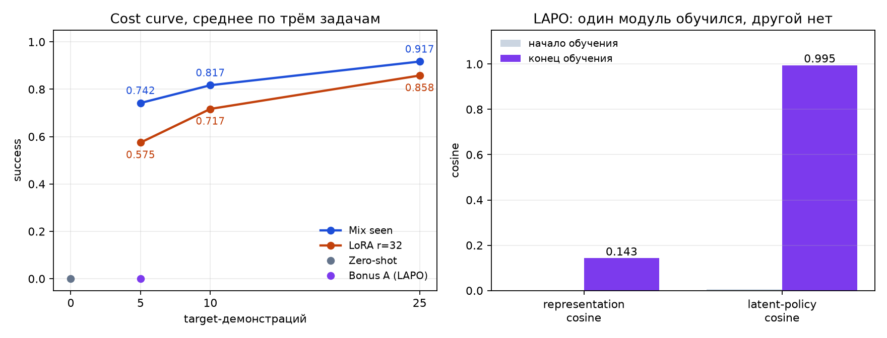

# Адаптация SmolVLA к новым задачам LIBERO

Чекпойнты, роллаут-видео и диагностика лежат в репозитории: [report_page.html](report_page.html), веса — в `runs/final/`.

Из мощностей у меня был MacBook Pro на M1 Max, но здесь он помог меньше всего: рендер LIBERO и сборка роллаут-видео на macOS не работали, поэтому всё поведение агента я впервые увидел только на финальном прогоне A100. Предварительного отсева на ноутбуке, как в остальных заданиях, тут нет.

Доступ к видеокартам был по университетским очередям, и я им воспользовался. Темы задания для меня новые, я долго разбирался в каждой из них, и на прогоны оставалось столько времени, сколько оставалось. Каждая точка кривой посчитана на 20 роллаутах и двух сидах обучения, адаптация идёт по 100 шагов.

Мой бэкграунд — представления данных, в большей степени мультимодальные, и в робототехнике я относительно неопытен. Именно из бэкграунда выросла бонусная часть с латентными действиями: восстановить действия из видео без разметки мне было интереснее, чем перебирать стандартные способы дообучения.

### Детали обучения

Претрен на знакомых задачах шёл пять тысяч шагов, и ошибка на них упала более чем на порядок. Это стоит зафиксировать сразу, потому что дальше будет много нулей, и объяснять их тем, что модель не успела обучиться, нельзя. Адаптацию я мерил на пяти, десяти и двадцати пяти демонстрациях, всего тридцать шесть прогонов по сто шагов каждый. Рядом идут латентные действия, снимки предсказанных действий, проверка без дообучения, контроль на чужой инструкции и видео роллаутов. Весь отчёт построен только на итоговых артефактах с A100.

## 1. Постановка, данные и предсказания

Я проверял, сколько демонстраций целевой задачи нужно SmolVLA после претренинга на `libero_90`. Seen-претрен использует 5000 шагов на 450 равномерно выбранных эпизодах из 4500 эпизодов `libero_90`. Target содержит первые 5, 10 или 25 демонстраций каждой из первых трёх задач `libero_goal`. Каждая итоговая точка посчитана на двадцати роллаутах, двух сидах обучения и одном общем сиде оценки.

До запусков я записал предсказания. Успех без дообучения я ожидал заметно выше нуля, потому что целевые и знакомые задачи делят сцены, робота и типы объектов. Кривую подмешивания я ожидал вогнутой, с основным приростом между пятью и десятью демонстрациями и насыщением к двадцати пяти. LoRA я ожидал сильнее на малой выборке и слабее на большой: низкий ранг защищает от переобучения, но и ограничивает, когда данных становится больше. От латентных действий я ждал наибольшей пользы при пяти демонстрациях, а к двадцати пяти обычное дообучение должно было разрыв сократить.

Из этих четырёх предсказаний не сбылись два, и разбор обоих идёт в разделе 4.

Задача незабывания кажется мне более общей: катастрофическое забывание возникает вообще везде в машинном обучении. Здесь она принимает конкретный вид. Если обучать на пяти примерах, модель быстро на них переобучается и тянет туда все градиенты.

Способы это сбалансировать сводятся к тому, чтобы сделать шаг менее разрушительным: подмешать старые примеры и тем самым ослабить градиент статистически, добавить регуляризацию по расхождению распределений, поставить маленький шаг обучения, или обучать низкоранговой поправкой — тогда у преобразования просто меньше возможностей переписать глубокие внутренние состояния, важные для решения задач.

Отдельно про аугментации. Небольшие искажения изображения — стандартная практика, но если аугментированные кадры больше нигде не встречаются ни в данных, ни в среде, то и пользы от них немного.

То есть методы здесь довольно базовые, и это нормально: интересна форма кривой, а не экзотика. Сверх этого я хотел сделать латентные действия — восстановить их из видео без разметки по методу LAPO. Это и есть бонусная часть.

## 2. Cost curve и выбранный метод

Я выбрал подмешивание знакомых задач: оно выигрывает у LoRA на всех трёх бюджетах, хотя LoRA обучает всего полтора миллиона параметров адаптера. Преимущество при этом не одинаково для каждой задачи — на второй при пяти демонстрациях LoRA оказалась лучше.

## 3. Фейлы и Bonus A

Среда здесь сложная, и отдельные неудачи агента интерпретировать трудно — это не самая близкая мне тема. Поэтому я опирался не на разбор отдельных роллаутов, а на то, что можно измерить.

Первая неудача — сплошной ноль до адаптации: ни одного успешного эпизода из шестидесяти, ни с правильной инструкцией, ни с чужой. Неготовностью модели это не объясняется, претрен на знакомых задачах сошёлся.

Второй фейл в том, что модель реагирует на текст, но этого недостаточно. Замена инструкции заметно меняет предсказанную последовательность действий, то есть язык до политики доходит. При этом контроль на чужой инструкции здесь вырождается: исходная политика не решает target-задачи ни с какой инструкцией, поэтому нулевая разница в успех ничего не говорит про язык. Чтобы этот контроль работал, его надо ставить на задачах, которые политика уже умеет решать.

Третья неудача — латентные действия. Метод провалился, но выучил не всё подряд: модуль латентной политики сошёлся почти идеально, а представление почти не сдвинулось с нуля. Ошибка предсказания настоящего действия осталась высокой, и на двух задачах из трёх подстановка настоящего латента не улучшает предсказание по сравнению с нулевым. Значит, узкое место лежит между представлением и декодером действий. Сказать, что виноваты именно сто шагов, я не могу: для этого нужен отдельный контроль с долгим обучением декодера. Но и общей нехваткой шагов это не объясняется: LoRA за те же сто шагов дала рабочий результат.

В бонусной части предсказатель учится на соседних кадрах знакомых видео без разметки действий, а декодер связывает предсказанное изменение с действиями только на разрешённых целевых демонстрациях. Результат — ноль успешных эпизодов из шестидесяти при пяти демонстрациях: внутренние ошибки снизились, но в поведение робота это не перенеслось.

## 4. Что изменилось после экспериментов

Я ожидал, что контроль на чужой инструкции отделит вклад языка, а получил 0/60 и там, и там. В исходном рассуждении я не учёл, что такой контроль осмыслен только на задачах, которые политика уже решает.

Я ожидал, что латентные действия хотя бы частично перенесутся в поведение, а получил ноль успешных эпизодов при почти идеально сошедшемся модуле политики. Поэтому интерпретацию я изменил: метод выучил не пустоту, а разорванную цепочку между представлением и декодером действий.

Объяснение «просто мало шагов» я отверг после того, как LoRA за те же 100 шагов получила 0.575. Механизм здесь другой: LoRA стартует от рабочей политики и меняет её низкоранговой поправкой, а LAPO должен сначала построить пространство латентных действий, и именно этот шаг не сошёлся. Аугментации я отверг ещё до прогонов по причине, описанной в разделе 1a.

Самым неожиданным оказалось то, что модуль с cosine 0.995 спокойно сосуществует с нулевым успех. Объясняю я это тем, что внутренние метрики измеряют согласованность модулей между собой, а не их полезность для управления. Отсюда основным инструментом диагностики становится сравнение настоящего latent с нулевым, потому что оно меряет ровно перенос в действия. От альтернативы, что декодер просто недоучен, это отделяет только отдельный длинный декодер-control, которого у меня нет.

На всех трёх бюджетах я выбрал подмешивание знакомых задач. Это решение стоило бы пересмотреть, если бы на большем числе задач повторилась картина второй задачи при пяти демонстрациях, где LoRA оказалась лучше, или если бы появилось ограничение на хранение знакомых данных.
